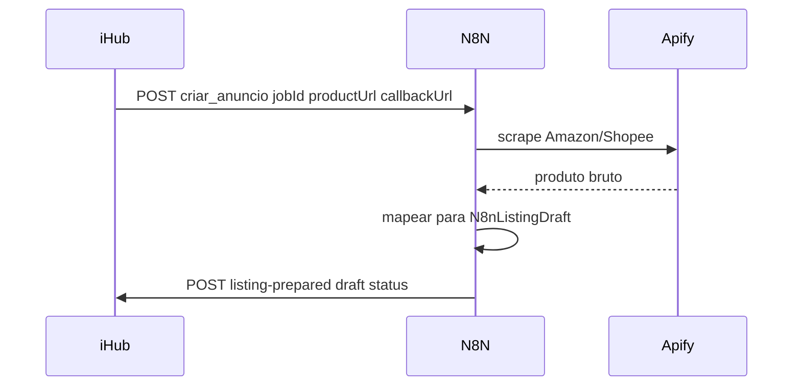

# N8N — scraping para criação de anúncios (iHub)

Esta pasta versiona o **contrato** iHub ↔ N8N e os **dois workflows** de scraping:

| Workflow | Destino |
| --- | --- |
| `workflows/criar_anuncio.json` | Mercado Livre |
| `workflows/criar_anuncio_amazon.json` | Amazon SP-API |

O grafo roda em [n8n.odontflow.com.br](https://n8n.odontflow.com.br). O iHub dispara o webhook certo conforme a conta de destino.

## Estrutura

```
n8n/
  README.md              ← este arquivo
  CONTRACT.md            ← payloads request/callback + N8nListingDraft
  examples/              ← fixtures JSON alinhadas ao iHub
  workflows/             ← export JSON do N8N (colar criar_anuncio.json)
```

## Fluxo



1. Usuário cola URL no iHub → `POST /products/prepare-from-link` (conta de destino ML ou Amazon).
2. iHub chama `N8N_PREPARE_WEBHOOK_URL` com `jobId`, `productUrl`, `callbackUrl`, `targetPlatform`.
3. N8N (Apify + mapeamento) monta draft **ML** ou **Amazon SP-API** conforme `targetPlatform`.
4. N8N faz `POST` em `callbackUrl` (`/api/webhooks/n8n/listing-prepared`).
5. iHub mostra o rascunho e publica no marketplace da conta (ML ou Amazon).

Detalhes dos bodies: [CONTRACT.md](CONTRACT.md). Exemplos: [examples/](examples/).

## Env no iHub (referência)

| Variável | Uso |
| --- | --- |
| `N8N_PREPARE_WEBHOOK_URL` | URL do webhook de início (ex. `…/webhook/criar_anuncio`) |
| `N8N_WEBHOOK_SECRET` | Bearer / `X-N8N-Secret` no callback |
| `IHUB_PUBLIC_URL` | Base para montar `callbackUrl` |

Código: `artifacts/api-server/src/lib/n8n-listings.ts`, `listing-prepare-jobs.ts`.

## Exportar o workflow do N8N

1. Abrir o workflow de prepare (criar anúncio) em odontflow.
2. Menu → **Download** / **Export** (JSON).
3. Salvar como [`workflows/criar_anuncio.json`](workflows/criar_anuncio.json).
4. Se existir workflow separado de publish/recebimento, exportar como `workflows/recebe_json_ihub.json`.

Instruções: [workflows/README.md](workflows/README.md).

## Importar de volta no N8N

1. N8N → **Add workflow** → **Import from File**.
2. Selecionar `workflows/criar_anuncio.json`.
3. Revisar credenciais Apify, URLs e o nó HTTP que chama o `callbackUrl`.
4. Conferir o body final contra [CONTRACT.md](CONTRACT.md) e [examples/](examples/).

## Escopo

- **Incluído:** scrape Amazon/Shopee → rascunho ML (`N8nListingDraft`).
- **Fora:** Amazon SP-API seller (estoque/anúncios da conta Seller no iHub) — pasta/skill separada.
